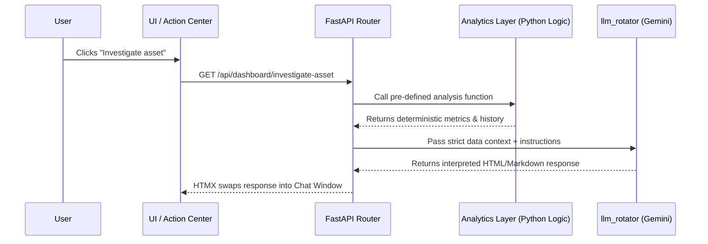
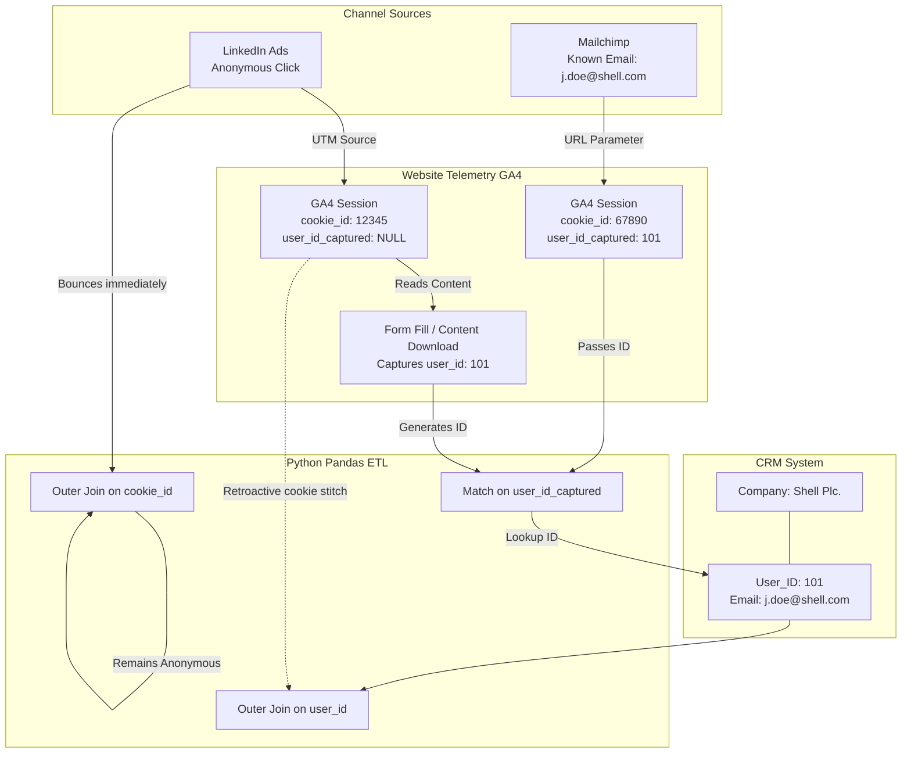

# Campaign telemetry engine: Design and architecture document

This document outlines the core architectural choices, rationale, and design systems implemented for the campaign telemetry engine project. 

## 1. Project rationale & market gap: Solving the multi-million dollar blind spot

### The market gap & the current issue
Imagine a Chief Marketing Officer at a global engineering firm sits down with their CEO. The CEO asks: "We spent $150,000 on the 'Offshore Wind' campaign over the last 12 months. Did it actually help us win the $10M Equinor contract?"

In today's landscape, the marketing team cannot answer that question directly. Enterprise B2B marketing is characterised by 18-month sales cycles and complex buying committees. Yet, marketers are forced to use analytics tools designed for 10-minute B2C e-commerce transactions. To answer the CEO, the team must pull up disconnected screens: Google Analytics for web traffic, Mailchimp for emails, LinkedIn for ad clicks, and Salesforce for the closed deal. 

When data is this fragmented, marketers suffer from **"dashboard blindness"** and default to reporting useless vanity metrics rather than actual pipeline revenue. 

### The team gap
Historically, extracting cross-channel insights required a dedicated Data Analyst writing complex SQL queries, or a marketer enduring weeks of training to master enterprise BI tools. Analysts and campaign managers spend excessive time manually cross-referencing assets and target accounts just to figure out what to do next. This creates a massive operational bottleneck: there is a missing link between *seeing* the data and *executing* the next best action.

### The solution: Prescriptive, agentic intelligence
This capstone project proposes a shift from descriptive analytics (what happened) to prescriptive, agentic intelligence (what we should do next). The Campaign Telemetry Engine acts as an active, tireless co-pilot that sits above the disconnected data silos to stitch the user journeys together. 

Rather than forcing the marketer to hunt through complex BI graphs to find out why a campaign is failing, the system proactively surfaces anomalies (e.g., asset fatigue) via an Action Center. The integrated AI Copilot instantly generates the necessary context and proposes corrective actions.

### Usability and target audience
This Agentic OS democratises data access by offering a highly guided, prescriptive interface. The system tells the user what needs attention, providing immediate value across specific roles:

**Current implementation:**
- **The CMO lobby view:** A dedicated executive dashboard providing board-ready ROI answers (e.g., "What is our overall pipeline velocity this quarter?" or "Blended CPA") without requiring the CMO to dig into individual tactical assets.
- **Campaign and demand gen managers:** Unlocks tactical day-to-day agility. The Omnichannel Asset Matrix proactively flags "Asset Fatigue", allowing them to instantly reallocate budget or rotate assets before ad spend is wasted.
- **Enterprise sales leadership:** Bridges the notorious marketing-sales divide. The account penetration view flags high-intent C-Suite targets, allowing sales directors to draft highly contextualised outreach via the AI Copilot.

### The capstone justification
Beyond solving a massive commercial pain point, this project was selected because it forces a collision between three advanced domains in software engineering today:

1. **Hallucination-free AI orchestration:** Implementing a Model Context Protocol (MCP)-like approach to force an LLM to rely strictly on deterministic, hard-coded Python math functions, proving that AI can be trusted with strict financial and performance data.
2. **Prescriptive, server-driven UI:** Moving past static frontend builds to a paradigm where the UI dynamically injects interactive AI analysis directly into the user's workflow using HTMX and FastAPI.
3. **Complex data stitching:** Architecting the logic to connect an anonymous web cookie to a known CRM contact across a fragmented, multi-channel landscape (via robust data simulation).

## 2. The core UX triad: Visualisation, action centre, and copilot

The user experience is built on a deliberate three-pillar philosophy:

1. **Data visualisation (The "what"):** 
   High-density, scannable matrices (such as the Omnichannel asset impact matrix) present unified telemetry. The visual taxonomy (colours, sparklines, spacing) is rigorously constrained to convey health and channel identity quickly without overwhelming the user.
2. **The action centre (The "so what"):** 
   An automated, dynamic to-do list (Priority actions) powered by the backend analytics engine. Instead of forcing the user to hunt for insights, the system mathematically detects trends and anomalies (e.g., calculating when an asset's traffic drops by 90% from its peak) and queues them up as actionable alerts.
3. **The AI copilot (The "now what"):** 
   An interactive assistant seamlessly embedded alongside the data. When the user interacts with an action centre item, the copilot guides them through execution—whether that means drafting a follow-up email sequence, analysing a channel mix, or suggesting asset rotations.

## 3. AI architecture: The model context protocol (MCP)-like function calling approach

To combat the inherent risk of large language model (LLM) hallucinations when analysing raw data, the AI copilot architecture heavily relies on a model context protocol (MCP)-like approach:

- **Deterministic data anchoring**: The AI does *not* query raw database tables freely, nor does it perform its own mathematical aggregations. Instead, deterministic, strictly tested Python functions run the core mathematical and business logic.
- **Programmatic injections**: When a user engages with the copilot (e.g., clicking an "Investigate asset" alert), the UI triggers a backend endpoint that acts as an intermediary. This endpoint fetches the strictly scoped, pre-calculated metrics from the Python functions and injects them as a strict `context_str` into the prompt for the Google Gemini LLM.
- **Hallucination reduction**: Because the LLM is only tasked with *interpreting*, *summarising*, and *generating content* based on highly curated, factual context provided by the backend—rather than calculating the metrics itself—data consistency is mathematically guaranteed. Users can confidently rely on the AI for strategic insights and drafting outreach without fear of fabricated numbers or phantom metrics.

### MCP interaction flow
The following sequence demonstrates how the copilot strictly adheres to the MCP-like architecture to maintain data integrity:

### Accessible python functions (MCP toolset)
The LLM does not have open-ended query access. It is anchored to the outputs of the following strict analytical functions:
- `calculate_blended_cpa(campaign_id)`: Calculates the blended cost per acquisition.
- `get_account_penetration(campaign_id)`: Maps engagement to specific CRM target accounts.
- `evaluate_trickle_threshold(campaign_id)`: Determines mathematical decay in traffic volume over time.
- `simulate_budget_shift(channel, shift_amount)`: Simulates projected pipeline impact of budget reallocation.
- `get_tam_penetration(industry, region)`: Calculates total addressable market penetration.
- `calculate_share_of_voice(competitors)`: Benchmarks campaign performance against competitors.
- `get_executive_pipeline_kpis(campaign_id)`: Aggregates hard performance stats (CPA, pipeline velocity) for the strategic TLDR.
- `get_budget_pacing(campaign_id)`: Returns current vs. expected spend pacing.
- `run_attribution_model(model_type, campaign_id)`: Executes specific multi-touch attribution models.
- `compare_asset_baselines(asset_a, asset_b)`: Isolates performance gaps between two assets.
- `map_buying_committee(account_identifier)`: Maps engaged personas within a specific account.
- `get_intent_surge_signals(account_identifier)`: Identifies 48-hour velocity spikes for an account.
- `get_asset_impact_matrix(campaign_id)`: Calculates fatigue and ROI scores per asset.
- `get_user_journey(name, company)`: Traces the deterministic multi-channel touchpoints for a specific user.
- `generate_ab_test_variants(asset_type, performance_data)`: Recommends data-backed A/B test variations.
- `draft_outreach_sequence(persona, context)`: Generates personalised sales outreach based on intent data.

## 4. LLM model selection & adaptability

The intelligence layer of the copilot is currently powered by gemini-3.6-flash. 

### Why gemini-3.6-flash?
While our **MCP architecture** offloads the mathematical heavy lifting to deterministic Python functions, `gemini-3.6-flash` provides unparalleled strategic reasoning when synthesising the massive array of data points returned by the 16 available MCP tools. 
1. **Deep synthesis**: The model can seamlessly cross-reference intent surge signals with asset fatigue to generate highly nuanced, board-ready strategic recommendations.
2. **Context window**: As the complexity of the data simulation grows (spanning web, email, LinkedIn, and CRM), the model effortlessly manages the large context payloads injected by the backend.
3. **Structured execution**: It strictly adheres to the requested JSON/Markdown formats necessary for the server-driven HTMX UI.

### The `llm_rotator.py` abstraction layer
A critical architectural decision was to isolate all AI model interactions within a dedicated service layer (`app/services/llm_rotator.py`) rather than hardcoding SDK calls throughout the application routes. 

This abstraction provides immense adaptability:
- **Centralised schema management**: By updating the JSON schema in one centralised location, the LLM instantly adapts to the new parameter requirements.
- **Model agnosticism**: The core telemetry application passes generic text prompts and data dictionaries to the rotator. The rotator handles the provider-specific SDK logic. 
- **Future-proofing & swapping**: If a new, highly specialised marketing model is released, or if the team wishes to migrate to an open-source local model, the developer only needs to update the adapter inside `llm_rotator.py`. The rest of the application remains completely untouched.

### Recursive AI generation (secondary `get_genai_client`)
Beyond the primary copilot chat interface, the system implements a powerful pattern of "recursive" AI invocation. Specific python MCP tools (such as `generate_ab_test_variants` and `draft_outreach_sequence`) utilise a secondary internal call to `get_genai_client()`. 

Instead of relying on faked data or static templates for copywriting, these analytical functions transparently spawn a secondary, specialised Gemini execution thread in the background. This allows the primary copilot to request an A/B test, triggering a backend tool that autonomously uses the LLM to write high-quality copy, and returns that generated text to the copilot. This recursive pattern replaces what could have been hardcoded "prototype debt" with true dynamic generation.

## 5. Core technology stack

The project was designed to use a modern, lightweight, server-driven architecture to prioritise development speed, flexibility and performance.

### Backend: FastAPI (Python)
- **Decision**: Use FastAPI as the core web framework.
- **Reasoning**: Python is the industry standard for data analytics and AI integration. FastAPI provides exceptional performance, native asynchronous support for non-blocking I/O which is essential for AI API calls and database queries, and seamless integration with Jinja2 for server-side template rendering.

### Frontend: HTMX + Alpine.js + Jinja2
- **Decision**: Avoidance of heavy single page application frameworks like React or Vue in favor of server-side rendering (SSR) augmented with HTMX and Alpine.js.
- **Reasoning**: 
  - **HTMX**: Allows for the creation of a dynamic, SPA-like experience (such as the interactive AI copilot chat) by sending asynchronous requests (e.g., `hx-post="/api/chat"`) and swapping HTML fragments directly into the DOM. This reduces JavaScript bundle sizes and keeps state management firmly on the server, acting as the perfect delivery mechanism for the programmatic AI responses.
  - **Alpine.js**: Handles lightweight client-side interactivity (e.g., tab switching, initialising Chart.js sparklines) without the overhead of a virtual DOM.
  - **Jinja2**: Enables dynamic HTML generation on the server, tightly aligned with our Python data structures.

### Styling: Tailwind CSS
- **Decision**: Utility-first CSS framework.
- **Reasoning**: Speed. Tailwind enables rapid UI prototyping directly within the HTML templates. While sacrificing some degree of control over the high level cascading styles, it allows to quickly develop complex, responsive UIs without managing massive external stylesheets. This was particularly useful for quickly iterating on the design of the prototype applicaiton.

### Database: SQLite
- **Decision**: Embedded relational database (`capstone.db`).
- **Reasoning**: Highly portable and requires zero configuration, making it ideal for the telemetry application's data storage needs. It allowed me to quickly develop and iterate on my database schema without the overhead of setting up a separate database server.

### Caching & State Management: Redis (with Graceful Local Fallback)
- **Decision**: In-memory key-value data store connected via `REDIS_URL`, backed by an automatic local JSON cache fallback (`llm_cache.json`).
- **Reasoning**: 
  - **LLM cost & latency reduction**: Generative AI API calls to models like Gemini introduce latency (1.5–3s) and recurring per-token compute costs. Redis stores SHA-256 hashed prompt-response pairs with a 24-hour time-to-live (`setex`), turning repeated strategic queries into sub-millisecond in-memory cache hits.
  - **Graceful degradation architecture**: Recognising that local evaluators or lightweight development environments might not always have an active Redis daemon running, the system wraps all Redis calls in a connection-safe fallback. If `REDIS_URL` is unavailable or unreachable, the engine seamlessly falls back to reading and persisting keys within `llm_cache.json` without failing or degrading the user experience.

### Visualisation: Chart.js
- **Decision**: Canvas-based charting library.
- **Reasoning**: It is performant enough to handle multiple mini-charts dynamically initialised inside Alpine blocks.

## 6. Data simulation setup and logic

To effectively test the campaign telemetry engine and develop the AI copilot without relying on sensitive or static client data, the project employs a code-driven data simulation pipeline. Building real-time integrations with live GA4, Salesforce, and LinkedIn APIs was not possible due to operational sensitivity of the required data. The simulation cleanly abstracts the data complexity while aspiring to maintain the mathematical realism. 

The pipeline is orchestrated by a single master script (`build_database.py`), which executes four distinct stages sequentially to guarantee a fresh, mathematically sound embedded SQLite database (`capstone.db`):

### 1. CRM foundation (`01_generate_crm.py`)
- **Firmographic generation**: Uses the `Faker` library to generate thousands of realistic B2B professionals, grouping them into specific target accounts (e.g., "Shell", "BP"), seniority levels, and job roles.

### 2. Baseline traffic generation (`02_generate_baseline_traffic.py`)
- **Background noise**: Injects randomised, standard traffic across email, LinkedIn, and web for legacy campaigns (e.g., Gastech) to simulate realistic marketing baseline noise.

### 3. The ABM simulation engine (`03_simulate_abm_journeys.py`)
This is the core mathematical engine. Rather than generating random noise, this script simulates highly realistic, **18-month cross-channel buyer journeys** for strategic account-based marketing (ABM) campaigns.
- **Campaign burst logic**: Events are mathematically clustered around specific marketing "bursts" (e.g., a webinar drop, a LinkedIn campaign launch) to simulate realistic traffic spikes and decay.
- **Fatigue modeling**: The script intentionally degrades traffic to specific older assets over time to mathematically trigger the "Asset fatigue" anomalies that the action center relies on.
- **In-memory alignment**: Crucially, the script guarantees logical temporal alignment. It ensures that a CRM "Opportunity created" event mathematically aligns with a recent campaign burst, enforcing the causal relationship between marketing touches and sales pipeline.

### 4. Identity resolution & ETL (`04_etl_load.py`)
The pipeline culminates in the ETL step, mimicking a modern customer data platform (CDP) to tie anonymous ad clicks to closed CRM deals. 

### 5. Post-ETL optimisation & anti-pattern purge (`05_create_indices.py`)
To ensure the analytical MCP functions can query the embedded database in milliseconds, a non-destructive indexing strategy was implemented.
- **Drop-load-rebuild pattern**: The ETL pipeline intentionally generates the database without indices (maximising bulk insert speed). Immediately after the data is loaded, `05_create_indices.py` applies 11 highly targeted B-Tree indices to critical foreign keys and filter columns.
- **Eradication of N+1 queries**: The Python analytical layer relies on bulk SQL aggregations (`GROUP BY` and `LEFT JOIN`) instead of executing N+1 query loops.
- **Index-aware filtering**: Queries explicitly use exact matches (`IN (?, ?)`) rather than wildcard full-table scans (`LIKE '%...%'`) to leverage the B-Tree indices fully.

This clean, 5-step modular architecture ensures that the analytics service can seamlessly track a single user across an email click, a social ad view, and subsequent web page interactions. This programmatic simulation allows our frontend visualisations and AI interpretations to simulate user journeys against complex, multi-touch attribution scenarios similar to real-world marketing scenarios.

## 7. Deployment strategy & cost implications

### Phase 1: Capstone release (PaaS / Cloud-Native)
For the initial capstone release, the application is designed to be deployed via **Render** (Platform-as-a-Service), automated through **GitHub actions**. 
- **Setup**: Pushes to the `main` branch trigger a GitHub action that tests the application and deploys it directly to Render. The embedded SQLite database (`capstone.db`) is packaged within the deployment for zero-configuration testing.
- **Cost**: Free. Render's free tiers are sufficient for demonstrating the UI, FastAPI backend, and handling lightweight traffic.
- **Limitations**: The SQLite database is ephemeral in containerised cloud environments unless mounted to a persistent disk. This is acceptable for the simulation, but not for production.

### Phase 2: Enterprise production (Cloud vs. On-Premises)
Moving beyond the capstone into a production enterprise environment requires architectural shifts, particularly concerning data privacy and scale.

#### Option A: Managed cloud (AWS / Azure / GCP)
- **Architecture**: The application database should migrate from SQLite to a managed PostgreSQL instance (e.g., AWS RDS). The FastAPI application should be deployed via container orchestration (e.g., AWS ECS or Kubernetes). Managed ETL tools (Fivetran/dbt) should be used to ingest real GA4 and CRM data continuously.
- **Cost Implications**:  
  - Database: ~$50-$200/month for a production RDS instance.
  - Compute: ~$50-$100/month for scalable container hosting.
  - LLM API Costs: Highly variable based on token usage. Utilising `gemini-3.6-flash` keeps costs low (fractions of a cent per query), but scaling across a large marketing team will incur ongoing operational expenses. The application attempts to mitigate the token usage via a caching strategy.
- **Pros**: Infinite scalability, zero hardware maintenance, rapid deployment.

#### Option B: On-Premises / air-gapped deployment
- **Architecture**: For enterprise engineering firms dealing with highly sensitive IP or strictly regulated financial data, the entire stack can be deployed on internal, on-premises servers. Because the application is fully containerised, it can run on internal Kubernetes clusters.
- **AI adaptation**: The `llm_rotator.py` abstraction allows the organisation to completely unplug from cloud-based AI providers (Google/OpenAI) and point the copilot to an internally hosted, open-source LLM (e.g., A marketing optimised model running via Ollama on a local GPU).
- **Cost implications**: High CapEx, Low OpEx.
  - Hardware: Significant upfront capital expenditure ($10k-$30k) for dedicated servers equipped with high-VRAM GPUs (e.g., NVIDIA A100s or multiple RTX 4090s) necessary to run LLMs locally.
  - Maintenance: Requires dedicated internal DevOps/IT personnel.
  - API Costs: $0. Once the hardware is purchased, infinite AI queries can be made without paying token fees.
- **Pros**: Absolute data sovereignty. Zero risk of proprietary CRM or pipeline data leaking to public cloud AI providers.

### 3. MCP tool execution architecture (Sequential vs Parallel)
The application utilises **parallel function calling** (batching multiple tool execution requests into a single API roundtrip) to drastically reduce LLM latency and minimise token expenditure. However, parallel execution introduces a dependency resolution challenge: an LLM cannot logically chain tools together if it executes them simultaneously (e.g., simulating a budget shift before knowing the available budget constraints).

To achieve both high-speed parallel execution and absolute data accuracy, the architecture utilises **abstract late binding**. Rather than forcing the LLM to guess numeric variables, MCP tools accept string constants (e.g., `budget="REMAINING_BUDGET"`). The Python backend intercepts these abstract strings, resolves the dependencies locally against the database, and injects the precise values into the mathematical models. This eliminates LLM hallucinations while maintaining low-latency parallel execution.

## 9. Testing strategy

Testing an agentic AI-integrated telemetry engine introduces specific set of challenges not traditionally encountered in web application testing. While standard applications rely on deterministic unit and E2E testing, integrating an autonomous LLM via the MCP introduces non-deterministic behavior, schema drift, and hallucination risks.

To achieve maximum reliability and provide documented evidence of CI/CD usage, the application implements a comprehensive, automated 5-tier testing strategy utilising `pytest` and GitHub Actions.

### 1. Unit testing & data boundaries (Core logic)
Before the AI model is allowed to reason about the data, the underlying mathematical calculations must be proven accurate.
- **Methodology**: The `tests/conftest.py` suite utilises a lightweight, in-memory SQLite database populated with a standardised set of mock campaign data, completely isolating the test environment from the production `capstone.db`.
- **Coverage**: The `tests/test_unit.py` suite strictly asserts the mathematical outputs and data types of the core analytical functions (e.g., `calculate_blended_cpa`, `get_tam_penetration`). It also enforces data boundary, ensuring tools strictly adhere to `campaign_id` and `timeframe` session context to prevent cross-campaign data leakage.

### 2. MCP contract testing (Preventing schema drift)
As the AI model relies on a strictly defined JSON schema (`mcp_tools`) to understand the backend Python tools it can call, "schema drift" is a fatal risk. 
- **Methodology**: The `tests/test_mcp_contracts.py` suite programmatically iterates over every tool defined in the JSON schema. It utilises Python's `inspect.signature` to read the actual backend function in `app/services/analytics.py`.
- **Coverage**: It mathematically asserts that every tool listed in the schema actually exists as a callable function, and that the parameters promised to the LLM exactly match the parameters the Python function accepts, making schema drift impossible.

### 3. MCP integration & data parity testing (Deterministic)
While unit tests prove the core math, integration tests are required to ensure the backend MCP tools generate outputs that mathematically match the data served by the frontend API routes.
- **Methodology**: The `tests/test_mcp_data_parity.py` suite executes priority MCP tools (e.g., `simulate_budget_shift`, `get_budget_pacing`) utilising FastAPIs `TestClient` to simultaneously fetch the raw UI data points.
- **Coverage**: It mathematically asserts that the backend tools (e.g., spend and pipeline logic) match the frontend source-of-truth exactly. This completely eliminates data divergence and forces strict alignment on cross-campaign scoping (using `timeframe` and `campaign_id`).

### 4. LLM-as-a-judge evaluation matrix & iterative refinement (Qualitative)
Traditional deterministic testing (asserting 1+1=2) is insufficient for evaluating the "usefulness" of LLM-generated telemetry. An output can be mathematically perfect but contextually absurd (e.g., projecting $66 Billion in pipeline from $100 of ad spend).
- **Methodology**: The `scripts/ai_evals_matrix.py` harness runs a cross-product matrix test. It executes priority MCP tools across multiple isolated timeframes and campaigns, bypassing the UI. The output payload is fed into a secondary Gemini LLM "Judge".
- **Measurement criteria**: The Judge strictly evaluates the payload on **Actionability** (can an executive make a financial or strategic decision based on this data?) and **Contextual relevance** (does this strictly answer the intent without noise?) on a 1-5 scale. 
- **Iterative refinement approach**: 
  Instead of guessing what context the AI needed, the AI harness works as a continuous feedback loop:
  1. **Measure baseline**: The first time the harness was run, the AI judge scored many tools as low (1/5 Actionability) because they returned raw HTML blobs, unsegmented data lists or programatically correct SQL queries that produced low quality information.
  2. **Optimise & enrich output**: Based on the AI judge's feedback, the Python logic was iteratively refactored. For example, `map_buying_committee` was modified to segment users by `seniority` and `persona`, and explicitly returns `job_titles`. `get_executive_pipeline_kpis` was modified to strictly calculate ROI off `closed-won` revenue, and added mathematical dampeners to `simulate_budget_shift` to account for audience exhaustion.
  3. **Verify improvement**: The results of the iterative refinement can be seen in the `eval_reports/` directory, proving that our data payload optimisations raised the `actionability` scores across all categories from 1/5 up to 4/5 and 5/5. This iterative process ensures the LLM copilot receives high-signal, executive-level data rather than raw vanity metrics.

### 5. LLM graceful fallback testing
Because LLMs are non-deterministic, the backend parser must be resilient to hallucinations, missing JSON brackets, and incorrect data types.
- **Methodology**: The `tests/test_llm_parsers.py` suite utilises `unittest.mock.patch` to intercept the Gemini API call and inject synthetic, malformed payloads.
- **Coverage**: It asserts that when the LLM returns catastrophic garbage (e.g., `I am an AI. [ { oops } ]`), the backend gracefully catches the `JSONDecodeError` and devolves to a safe fallback state (rendering an empty UI state or an "AI Unavailable" warning) rather than crashing the application with a `500 Internal Server Error`.

### 6. Presentation layer testing (API routes)
Because the frontend relies on HTMX for dynamic swapping, the FastAPI backend acts as the presentation layer.
- **Methodology**: The `tests/test_api.py` suite utilises `fastapi.testclient.TestClient` to programmatically fire HTTP `GET` requests against the core endpoints (e.g., `/api/dashboard/overview`).
- **Coverage**: It asserts that the HTMX endpoints correctly return `200 OK` status codes and valid HTML fragments, ensuring the UI remains intact even as the underlying analytics engine is refactored.

### 7. Continuous integration (GitHub Actions)
To enforce quality control across the team and prevent broken code from reaching production, the entire testing suite is automated via CI/CD.
- **Methodology**: A GitHub Actions workflow (`.github/workflows/ci.yml`) is triggered on every push and pull request to the `main` branch. It provisions a clean environment, installs dependencies, and executes the full `pytest` suite.
- **Deployment Gate**: The Render deployment pipeline is configured to monitor the GitHub commit status. If any test fails (e.g., an MCP contract mismatch), Render blocks the deployment, ensuring the live dashboard remains stable.

## 10. Caching, configuration and performance optimisation

To support scaling from a Capstone MVP to a production application handling millions of telemetry rows and concurrent AI requests, the application implements a robust configuration and multi-tiered caching strategy.

### 1. Twelve-factor configuration management
To decouple the application from its local environment and facilitate automated testing and deployment (e.g., on Render), core infrastructure paths are managed dynamically via environment variables (e.g., `DATABASE_URL`, `REDIS_URL`). This prevents hardcoded "magic strings" and allows the application to instantly pivot between development, testing, and production databases.

### 2. AI response caching (LLM layer)
To optimise latency and eliminate redundant LLM API costs, the telemetry engine implements a two-tier caching strategy.  
- **Strategy**: The application utilises a centralised **Redis** instance to cache LLM responses. Before making an external API call to Gemini/OpenAI, the MCP layer hashes the deterministic `context_str`. If that exact data footprint was analysed recently, the system instantly returns the cached Markdown response from Redis. This prevents redundant API token expenditure and reduces UI latency to 0ms.
- **Fallback mechanism**: To ensure absolute resilience, the system implements a graceful fallback. If the Redis server is unreachable, it automatically devolves to a local JSON persistent cache (`llm_cache.json`).

### 3. HTMX fragment caching & async offloading
Since the architecture relies heavily on server-side rendering (SSR) via FastAPI and Jinja2, the server bears the load of generating HTML strings.
- **Strategy**: FastAPI and Starlette's threadpool isolate blocking operations (such as SQLite aggregation queries and synchronous Gemini LLM API calls) onto separate worker threads. Furthermore, components that rely on the LLM (like the Strategic TL;DR) are lazily loaded using HTMX. This ensures the primary dashboard data renders instantly, providing the user with immediate value while the AI finishes processing in the background.

## 11. Technical debt & future architectural roadmap

While the current MVP implements sophisticated R&D for the MCP-style generative UI and Redis caching, some deliberate architectural shortcuts were taken in the data access layer to prioritise milestone delivery. To fully elevate the application to production-grade enterprise software, the following structural refactoring is planned for the roadmap:

### 1. Abstracting data access via the repository pattern
The core `app/services/analytics.py` service currently acts as a monolithic "God Object." It mixes raw SQLite queries (data access), Python mathematical aggregations (business logic), and dictionary formatting for the frontend charts (presentation logic). This violates the single responsibility principle (SRP). 
- **Roadmap action:** The plan to implement the **repository pattern** to abstract all raw SQL queries into a dedicated `repository.py` layer should be implemented. The analytics service will act strictly as an orchestrator, retrieving clean objects from the repository and applying business logic.

### 2. Full rollout of dependency injection
While FastAPI's native **dependency injection** (`Depends(get_db)`) has been successfully implemented in the UI routing layer (`dashboard.py`) to manage database connection lifecycles via the `Unit of Work` pattern, the core MCP AI tools in `analytics.py` currently manage their own internal connections.
- **Roadmap action:** A future refactor will decouple the AI tool schema definitions from the underlying Python functions. This will allow to inject the database dependencies cleanly into the analytics layer without accidentally exposing the `db` connection parameter to the LLM's automated function calling schema.

### 3. Declarative tool chaining engine (MCP orchestration)
To fully eliminate the need for hardcoded late binding in complex agentic workflows, the system will eventually adopt a full **declarative tool chaining** engine. Instead of the LLM guessing parameters or using hardcoded string enums, the LLM will construct a directed acyclic graph (DAG) using JSON references (e.g., `budget: "$ref.get_budget_pacing.shortfall"`). This will require building a robust Python orchestration layer capable of parsing the LLM's graph, executing tools sequentially, mapping dynamic output variables to inputs, and handling execution failures gracefully.
