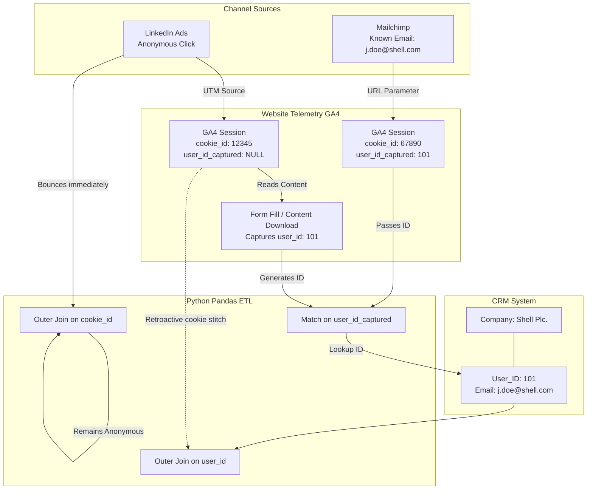

Synthetic Data & Identity Resolution Strategy
=============================================

1\. Top-Down Relational Generation (The "Seed")
-----------------------------------------------

To simulate a B2B Account-Based Marketing (ABM) environment, we cannot generate random, disconnected events. We must build a relational foundation first.

*   **Step 1: Generate Accounts (CRM)**: We hardcode 10-15 target companies (e.g., company\_id=1, name=Shell, domain=shell.com).
    
*   **Step 2: Generate Core Users (CRM Contacts)**: Using Faker, we generate 30-50 users per account. Each user gets a unique user\_id, a messy job\_title, and an email (e.g., user\_id=101, email=j.doe@shell.com).
    
*   **Result**: This acts as our static CRM database. These are our baseline **Known Users**.
    

2\. Dynamic Startup Seeding (The Cloud Workaround)
--------------------------------------------------

Because Render's free tier spins down after 15 minutes of inactivity, we cannot rely on a daily cron job to keep data fresh.

*   **The Solution:** Every time the FastAPI server boots, a seed\_db() Python function runs. It grabs datetime.now() and uses a timedelta loop to generate exactly 90 days of synthetic touchpoints trailing backward from that exact second. This guarantees the Capstone grader always sees a perfectly formatted, real-time dashboard.
    

3\. Channel Schemas & Field Generation
--------------------------------------

To merge data successfully in Pandas, we must simulate the exact fields each platform outputs.

### CRM Data (Salesforce/HubSpot Simulation)

*   event\_id, user\_id, account\_id, email, job\_title
    
*   event\_type (Opportunity Created, Stage Advanced, Closed Won)
    
*   pipeline\_value (e.g., $45,000), timestamp
    

### Mailchimp Data

*   event\_id, email (Primary Key for Email)
    
*   campaign\_id, action (Open, Click)
    
*   url\_clicked (Contains unique tracking parameters), timestamp
    

### LinkedIn Ads Data

*   event\_id, campaign\_id, ad\_id
    
*   click\_id (Anonymous), utm\_source=linkedin
    
*   spend\_consumed (e.g., $15.50), timestamp
    

### GA4 Data (Website Telemetry)

*   session\_id, cookie\_id (Anonymous)
    
*   utm\_source, utm\_campaign, page\_viewed, bounce\_flag (True/False)
    
*   user\_id\_captured (Simulates a privacy-compliant hashed email or CRM ID captured upon form fill), timestamp
    

4\. The Identity Buckets & Event Generation
-------------------------------------------

When generating the chronological timeline data, we divide our traffic into three simulated buckets:

*   **Bucket A: The "Golden Path"** (Full Funnel & CRM Conversion - ~20% of traffic): We pull a user\_id. They get a Mailchimp "Open", a LinkedIn "Click", a GA4 "Pageview" (where they submit a form), and a CRM "Opportunity Created" event attached to their user\_id.
    
*   **Bucket B: The "Partial Match"** (Cross-channel disconnect / No Conversion - ~50% of traffic): We pull a user\_id. We generate a Mailchimp "Open" and a GA4 "Pageview", but they bounce. There is no CRM event.
    
*   **Bucket C: The "Ghost"** (Anonymous/New - ~30% of traffic): We generate a brand new LinkedIn click and GA4 visit with a random cookie\_id. user\_id\_captured is NULL. They consume ad spend, but because they are unknown, they can never trigger a CRM Opportunity.
    

5\. Identity Resolution: De-anonymization & Matching Logic
----------------------------------------------------------

How do we know a specific Shell user interacted if they started as an anonymous click? We will use a deterministic Identity Graph approach in our Python ETL (Pandas).

### The Pandas ETL Step-by-Step Flow

1.  **The Anchor**: Load the CRM Users table as the central source of truth.
    
2.  **Mailchimp Join**: Join Mailchimp data to CRM data directly using the email column.
    
3.  \# Identify cookies that eventually convertedconverted\_cookies = ga4\_df\[ga4\_df\['user\_id\_captured'\].notna()\]\[\['cookie\_id', 'user\_id\_captured'\]\]# Retroactively map the user\_id to ALL previous sessions with that cookiega4\_df = ga4\_df.merge(converted\_cookies, on='cookie\_id', how='left')
    
    *   Filter GA4 for rows where user\_id\_captured is NOT NULL (the user filled a form).
        
    *   In Pandas, merge these captured IDs back onto the original GA4 dataframe to retroactively identify past anonymous sessions:
        
4.  **The Final Master Merge**: Execute pd.merge(how='outer') across all channel tables, grouped by user\_id (for known users) or cookie\_id (for remaining ghosts), sorted by timestamp.
    

### Architectural Flow Diagram

