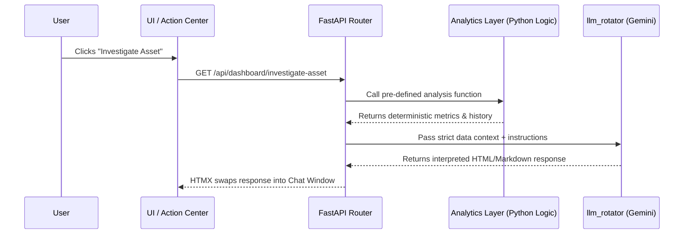
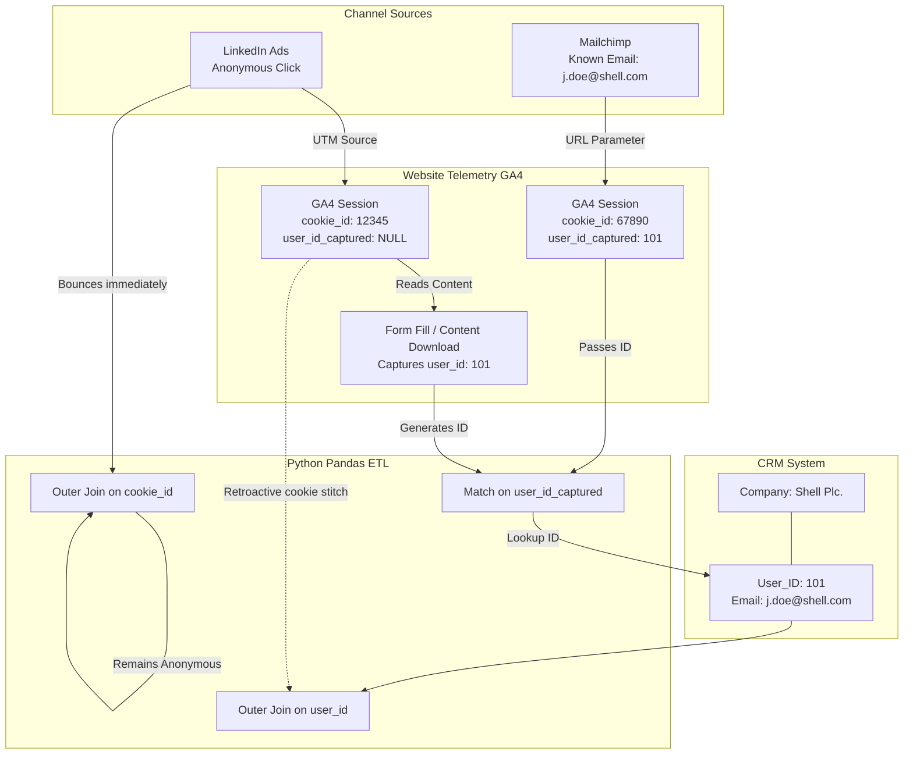

# Campaign Telemetry Engine: Design & Architecture Document

This document outlines the core architectural choices, rationale, and design systems implemented for the Campaign Telemetry Engine project. 

## 1. Project Rationale & Market Gap: Solving the Multi-Million Dollar Blind Spot

### The Market Gap & The Current Issue
Imagine a Chief Marketing Officer at a global engineering firm sits down with their CEO. The CEO asks: "We spent $150,000 on the 'Offshore Wind' campaign over the last 12 months. Did it actually help us win the $10M Equinor contract?"

In today's landscape, the marketing team cannot answer that question directly. Enterprise B2B marketing is characterized by 18-month sales cycles and complex buying committees. Yet, marketers are forced to use analytics tools designed for 10-minute B2C e-commerce transactions. To answer the CEO, the team must pull up disconnected screens: Google Analytics for web traffic, Mailchimp for emails, LinkedIn for ad clicks, and Salesforce for the closed deal. 

When data is this fragmented, marketers suffer from **"dashboard blindness"** and default to reporting useless vanity metrics rather than actual pipeline revenue. 

### The Team Gap
Historically, extracting cross-channel insights required a dedicated Data Analyst writing complex SQL queries, or a marketer enduring weeks of training to master enterprise BI tools. Analysts and campaign managers spend excessive time manually cross-referencing assets and target accounts just to figure out what to do next. This creates a massive operational bottleneck: there is a missing link between *seeing* the data and *executing* the next best action.

### The Solution: Prescriptive, Agentic Intelligence
This capstone project proposes a shift from descriptive analytics (what happened) to prescriptive, agentic intelligence (what we should do next). The Campaign Telemetry Engine acts as an active, tireless co-pilot that sits above the disconnected data silos to stitch the user journeys together. 

Rather than forcing the marketer to hunt through complex BI graphs to find out why a campaign is failing, the system proactively surfaces anomalies (e.g., asset fatigue) via an Action Center. The integrated AI Copilot instantly generates the necessary context and proposes corrective actions.

### Usability & Target Audience
This Agentic OS democratizes data access by offering a highly guided, prescriptive interface. The system tells the user what needs attention, providing immediate value across specific roles:

**Current Implementation:**
- **Campaign & Demand Gen Managers:** Unlocks tactical day-to-day agility. The Omnichannel Asset Matrix proactively flags "Asset Fatigue", allowing them to instantly reallocate budget or rotate assets before ad spend is wasted.
- **Enterprise Sales Leadership:** Bridges the notorious marketing-sales divide. The Account Penetration view flags high-intent C-Suite targets, allowing sales directors to draft highly contextualized outreach via the AI Copilot.

**Future Sprints (Roadmap):**
- **The CMO Lobby View:** Future iterations will include a dedicated executive dashboard providing board-ready ROI answers (e.g., "What is our overall pipeline velocity this quarter?" or "Blended CPA") without requiring the CMO to dig into individual tactical assets.

### The Capstone Justification (Technical Rigor)
Beyond solving a massive commercial pain point, this project was selected because it forces a collision between three of the most advanced domains in software engineering today:

1. **Hallucination-Free AI Orchestration:** Implementing a Model Context Protocol (MCP)-like approach to force an LLM to rely strictly on deterministic, hard-coded Python math functions, proving that AI can be trusted with strict financial and performance data.
2. **Prescriptive, Server-Driven UI:** Moving past static frontend builds to a paradigm where the UI dynamically injects interactive AI analysis directly into the user's workflow using HTMX and FastAPI.
3. **Complex Data Stitching:** Architecting the logic to connect an anonymous web cookie to a known CRM contact across a fragmented, multi-channel landscape (via robust data simulation).

## 2. The Core UX Triad: Visualization, Action Center, & Copilot

The user experience is built on a deliberate three-pillar philosophy:

1. **Data Visualization (The "What"):** 
   High-density, scannable matrices (such as the Omnichannel Asset Impact Matrix) present unified telemetry. The visual taxonomy (colors, sparklines, spacing) is rigorously constrained to convey health and channel identity quickly without overwhelming the user.
2. **The Action Center (The "So What"):** 
   An automated, dynamic to-do list (Priority Actions) powered by the backend analytics engine. Instead of forcing the user to hunt for insights, the system mathematically detects trends and anomalies (e.g., calculating when an asset's traffic drops by 90% from its peak) and queues them up as actionable alerts.
3. **The AI Copilot (The "Now What"):** 
   An interactive assistant seamlessly embedded alongside the data. When the user interacts with an Action Center item, the Copilot guides them through execution—whether that means drafting a follow-up email sequence, analyzing a channel mix, or suggesting asset rotations.

## 3. AI Architecture: The MCP-like Function Calling Approach

To combat the inherent risk of Large Language Model (LLM) hallucinations when analyzing raw data, the AI Copilot architecture heavily relies on a **Model Context Protocol (MCP)-like approach**:

- **Deterministic Data Anchoring**: The AI does *not* query raw database tables freely, nor does it perform its own mathematical aggregations. Instead, deterministic, strictly tested Python functions run the core mathematical and business logic.
- **Programmatic Injections**: When a user engages with the Copilot (e.g., clicking an "Investigate Asset" alert), the UI triggers a backend endpoint that acts as an intermediary. This endpoint fetches the strictly scoped, pre-calculated metrics from the Python functions and injects them as a strict `context_str` into the prompt for the Google Gemini LLM.
- **Hallucination Reduction**: Because the LLM is only tasked with *interpreting*, *summarizing*, and *generating content* based on highly curated, factual context provided by the backend—rather than calculating the metrics itself—data consistency is mathematically guaranteed. Users can confidently rely on the AI for strategic insights and drafting outreach without fear of fabricated numbers or phantom metrics.

### MCP Interaction Flow
The following sequence demonstrates how the Copilot strictly adheres to the MCP-like architecture to maintain data integrity:

### Accessible Python Functions
The LLM does not have open-ended query access. It is anchored to the outputs of the following strict analytical functions:
- `get_asset_impact_matrix(campaign_id)`: Calculates fatigue and ROI scores per asset.
- `get_account_penetration(campaign_id)`: Maps engagement to specific CRM target accounts.
- `evaluate_trickle_threshold()`: Determines mathematical decay in traffic volume over time.
- `get_kpi_benchmarks(campaign_id)`: Aggregates hard performance stats (CPA, Pipeline Velocity) for the Strategic TLDR.

## 4. LLM Model Selection & Adaptability

The intelligence layer of the Copilot is currently powered by Google Gemini models, specifically defaulting to **`gemini-3.5-flash`**. 

### Why `gemini-3.5-flash`?
In an autonomous data agent, querying raw SQL tables and performing deep mathematical reasoning requires a heavy model (like `gemini-1.5-pro`). However, because of our **MCP architecture**, `flash` is actually the optimal model for this application:
1. **Offloaded Cognitive Burden**: The Python backend (`analytics.py`) does all the mathematical heavy lifting. The LLM is handed a strictly formatted payload of established facts (e.g., "Asset X dropped 90% in traffic"). 
2. **Linguistic Summarization**: The LLM only needs to interpret the pre-calculated data linguistically, format it into HTML/Markdown, and suggest standard B2B marketing pivots. `flash` is exceptionally capable at this specific task.
3. **Ultra-Low Latency**: For an interactive Action Center UI, speed is paramount. `flash` returns responses in a fraction of a second, ensuring the UI feels like a reactive software application rather than a slow AI text generator.

### The `llm_rotator.py` Abstraction Layer
A critical architectural decision was to isolate all AI model interactions within a dedicated service layer (`app/services/llm_rotator.py`) rather than hardcoding SDK calls throughout the application routes. 

This abstraction provides immense adaptability:
- **Model Agnosticism**: The core telemetry application passes generic text prompts and data dictionaries to the rotator. The rotator handles the provider-specific SDK logic. 
- **Cost/Performance Routing**: If a future feature requires intense strategic reasoning (e.g., rewriting an entire 10-touch email sequence in a specific brand voice), the `llm_rotator` can seamlessly route that specific endpoint to a heavier model like `gemini-pro`, while keeping `flash` for rapid, day-to-day dashboard queries.
- **Future-Proofing & Swapping**: If a new, highly specialized marketing model is released, or if the team wishes to migrate to an open-source local model (e.g., via Ollama for extreme data privacy) or alternative providers (like Anthropic Claude or OpenAI), the developer only needs to update the adapter inside `llm_rotator.py`. The rest of the application (the UI, the analytics engine, the API routes) remains completely untouched.

## 5. Core Technology Stack

The project adopts a modern, lightweight, server-driven architecture to prioritize development speed and performance.

### Backend: FastAPI (Python)
- **Decision**: Use FastAPI as the core web framework.
- **Reasoning**: Python is the industry standard for data analytics and AI integration. FastAPI provides exceptional performance, native asynchronous support for non-blocking I/O (essential for AI API calls and database queries), and seamless integration with Jinja2 for server-side template rendering.

### Frontend: HTMX + Alpine.js + Jinja2
- **Decision**: Avoid heavy Single Page Application (SPA) frameworks like React or Vue in favor of Server-Side Rendering (SSR) augmented with HTMX and Alpine.js.
- **Reasoning**: 
  - **HTMX**: Allows us to build a dynamic, SPA-like experience (such as the interactive AI Copilot chat) by sending asynchronous requests (e.g., `hx-post="/api/chat"`) and swapping HTML fragments directly into the DOM. This drastically reduces JavaScript bundle sizes and keeps state management firmly on the server, acting as the perfect delivery mechanism for our programmatic AI responses.
  - **Alpine.js**: Handles lightweight client-side interactivity (e.g., tab switching, initializing Chart.js sparklines) without the overhead of a virtual DOM.
  - **Jinja2**: Enables dynamic HTML generation on the server, tightly coupled with our Python data structures.

### Styling: Tailwind CSS
- **Decision**: Utility-first CSS framework.
- **Reasoning**: Enables rapid UI prototyping directly within the HTML templates. It allowed us to easily enforce our strict color taxonomy and build complex, responsive glassmorphism UIs without managing massive external stylesheets.

### Database: SQLite
- **Decision**: Embedded relational database (`capstone.db`).
- **Reasoning**: Highly portable and requires zero configuration, making it ideal for the current milestone to store relational telemetry (e.g., `ga4_events` joining with `crm_users`).

### Analytics & Visualization: Chart.js
- **Decision**: Canvas-based charting library.
- **Reasoning**: Used for rendering the timeline sparklines. It is performant enough to handle multiple mini-charts dynamically initialized inside Alpine `x-data` blocks.

## 6. Data Simulation Setup & Logic

To effectively test the Campaign Telemetry Engine and develop the AI Copilot without relying on sensitive or static client data, the project employs a rigorous, code-driven data simulation strategy. Building real-time integrations with live GA4, Salesforce, and LinkedIn APIs requires massive ETL pipelines (e.g., dbt or Fivetran), which falls outside the scope of this capstone. The simulation cleanly abstracts this complexity while maintaining mathematical realism.

### The Modular Data Generation Pipeline (`app/data/pipeline/`)
To effectively test the Campaign Telemetry Engine and develop the AI Copilot without relying on sensitive client data, a robust, modular Python pipeline was built. Building real-time integrations with live GA4, Salesforce, and LinkedIn APIs requires massive ETL pipelines (e.g., dbt), which falls outside the scope of this capstone. The simulation elegantly abstracts this complexity.

The pipeline is orchestrated by a single master script (`build_database.py`), which executes four distinct stages sequentially to guarantee a fresh, mathematically sound embedded SQLite database (`capstone.db`):

#### 1. CRM Foundation (`01_generate_crm.py`)
- **Firmographic Generation**: Uses the `Faker` library to generate thousands of realistic B2B professionals, grouping them into specific target accounts (e.g., "Shell", "BP"), seniority levels, and job roles.

#### 2. Baseline Traffic Generation (`02_generate_baseline_traffic.py`)
- **Background Noise**: Injects randomized, standard traffic across email, LinkedIn, and web for legacy campaigns (e.g., Gastech) to simulate realistic marketing baseline noise.

#### 3. The ABM Simulation Engine (`03_simulate_abm_journeys.py`)
This is the core mathematical engine. Rather than generating random noise, this script simulates highly realistic, **18-month cross-channel buyer journeys** for strategic Account-Based Marketing (ABM) campaigns.
- **Campaign Burst Logic**: Events are mathematically clustered around specific marketing "bursts" (e.g., a webinar drop, a LinkedIn campaign launch) to simulate realistic traffic spikes and decay.
- **Fatigue Modeling**: The script intentionally degrades traffic to specific older assets over time to mathematically trigger the "Asset Fatigue" anomalies that the Action Center relies on.
- **In-Memory Alignment**: Crucially, the script guarantees logical temporal alignment. It ensures that a CRM "Opportunity Created" event mathematically aligns with a recent campaign burst, enforcing the causal relationship between marketing touches and sales pipeline.

#### 4. Identity Resolution & ETL (`04_etl_load.py`)
The pipeline culminates in the ETL step, mimicking a modern Customer Data Platform (CDP) to tie anonymous ad clicks to closed CRM deals. It loads the simulation dataframes into the database and generates the `master_summary` table.

This clean, 4-step modular architecture ensures that the analytics service can seamlessly track a single user across an email click, a social ad view, and subsequent web page interactions. This programmatic simulation guarantees that our frontend visualizations and AI interpretations are battle-tested against complex, multi-touch attribution scenarios identical to real-world enterprise datasets.

## 7. Architectural Patterns

A rigorous design taxonomy was established to ensure visual consistency and cognitive ease for the user.

### Color Logic
We deliberately decoupled aesthetic identity from status indication to prevent visual confusion:
- **Status Indicators (Semantic)**: 
  - `Emerald`: Success / High Performing / Active
  - `Amber`: Warning / At Risk
  - `Rose`: Critical / Asset Fatigue / Dropped Traffic
- **Channel Identity (Aesthetic)**: 
  - `Cyan`: Web Pages
  - `Violet`: Email Campaigns
  - `Blue / Sky`: Social Ads & LinkedIn

### High-Density Layouts
- **Decision**: Move away from heavily padded, generic card layouts in favor of dense, data-rich list views.
- **Implementation**: In the Omnichannel Asset Impact Matrix, we removed repetitive pill badges and redundant AI text blocks. We replaced them with left-border color coding (for health status) and integrated the actionable AI insights directly into the Copilot Action Center sidebar. This doubled the number of assets visible on screen without requiring a scroll, ensuring the user has maximum context at a glance.

## 8. Deployment Strategy & Cost Implications

### Phase 1: Capstone Release (PaaS / Cloud-Native)
For the initial capstone milestone, the application is designed to be deployed via **Render** (Platform-as-a-Service), automated through **GitHub Actions**. 
- **Setup**: Pushes to the `main` branch trigger a GitHub Action that builds the Docker container and deploys it directly to Render. The embedded SQLite database (`capstone.db`) is packaged within the deployment for zero-configuration testing.
- **Cost**: Extremely low to free. Render's free or hobby tiers ($7-$15/month) are sufficient for demonstrating the UI, FastAPI backend, and handling lightweight traffic.
- **Limitations**: The SQLite database is ephemeral in containerized cloud environments unless mounted to a persistent disk. This is perfectly acceptable for the capstone simulation, but not for production.

### Phase 2: Enterprise Production (Cloud vs. On-Premises)
Moving beyond the capstone into a production enterprise environment requires architectural shifts, particularly concerning data privacy and scale.

#### Option A: Managed Cloud (AWS / Azure / GCP)
- **Architecture**: Migrate from SQLite to a managed PostgreSQL instance (e.g., AWS RDS). Deploy the FastAPI application via container orchestration (e.g., AWS ECS or Kubernetes). Use managed ETL tools (Fivetran/dbt) to ingest real GA4 and CRM data continuously.
- **Cost Implications**: Moderate to High. 
  - Database: ~$50-$200/month for a production RDS instance.
  - Compute: ~$50-$100/month for scalable container hosting.
  - LLM API Costs: Highly variable based on token usage. Utilizing `gemini-3.5-flash` keeps costs low (fractions of a cent per query), but scaling across a large marketing team will incur ongoing operational expenses (OpEx).
- **Pros**: Infinite scalability, zero hardware maintenance, rapid deployment.

#### Option B: On-Premises / Air-Gapped Deployment
- **Architecture**: For enterprise engineering firms dealing with highly sensitive IP or strictly regulated financial data, the entire stack can be deployed on internal, on-premises servers. Because the application is fully containerized, it can run on internal Kubernetes clusters.
- **AI Adaptation (Crucial)**: The `llm_rotator.py` abstraction allows the organization to completely unplug from cloud-based AI providers (Google/OpenAI) and point the Copilot to an internally hosted, open-source LLM (e.g., Llama 3 running via Ollama on a local GPU).
- **Cost Implications**: High CapEx, Low OpEx.
  - Hardware: Significant upfront capital expenditure ($10k-$30k) for dedicated servers equipped with high-VRAM GPUs (e.g., NVIDIA A100s or multiple RTX 4090s) necessary to run LLMs locally.
  - Maintenance: Requires dedicated internal DevOps/IT personnel.
  - API Costs: $0. Once the hardware is purchased, infinite AI queries can be made without paying token fees.
- **Pros**: Absolute data sovereignty. Zero risk of proprietary CRM or pipeline data leaking to public cloud AI providers.

## 9. Software Testing Strategy

Testing an AI-integrated telemetry engine requires a dual approach: verifying standard application logic and ensuring the LLM acts deterministically. Because the primary objective of this capstone was to prove the feasibility of the MCP-like architecture and the HTMX Generative UI, testing efforts were heavily focused on data-integrity and manual integration rather than a comprehensive automated CI/CD pipeline.

### Manual Data-Integrity Testing (Prototyping Phase)
During development, the core analytical functions were isolated and tested using a suite of dedicated Python scripts (archived under `_archive_scripts/`, e.g., `test_matrix.py`, `test_kpi.py`, `test_spark.py`). 
- **Methodology**: These scripts queried the SQLite database directly, executed the Pandas aggregations, and printed the resulting DataFrames to the console. 
- **Reasoning**: It was critical to verify that the mathematical logic for complex queries (like cross-channel attribution and rolling 30-day velocity averages) was 100% accurate before hooking these functions up to the FastAPI endpoints or the AI Copilot.

### Deterministic AI Context Testing
The most critical testing focused on the **Model Context Protocol (MCP)** implementation.
- **Methodology**: Before sending payloads to the Google Gemini API via `llm_rotator.py`, the exact `context_str` generated by the backend was intercepted and logged. We manually cross-referenced the numerical values injected into the prompt against raw SQL queries.
- **Reasoning**: This was necessary to mathematically prove that the LLM was receiving factual data and to verify that its output (the generated HTML/Markdown) did not hallucinate new metrics.

### Automated Testing (Roadmap & Recommendations)
While a full automated test suite was not implemented for the Capstone MVP release (to prioritize architectural R&D), the application is structurally designed to support standard Python testing frameworks in production:
- **Unit Tests (`pytest`)**: The `app/services/analytics.py` file is highly decoupled. In production, `pytest` should be used alongside an in-memory SQLite database (populated with mocked `simulate_journeys.py` data) to automatically assert that the analytical functions return the correct DataFrame shapes and values.
- **API Integration Tests**: Using FastAPI's native `TestClient`, automated tests should verify that HTMX endpoints (e.g., `/api/dashboard/investigate-asset`) correctly return `200 OK` status codes and valid HTML fragments.
- **End-to-End (E2E) UI Tests**: Given the reliance on HTMX for DOM manipulation, tools like **Playwright** are recommended to automate the user flows (e.g., clicking an Action Center item and verifying the Copilot sidebar opens and renders the AI response).

## 10. Caching & Performance Optimization (Roadmap)

To support scaling from a Capstone MVP to a production-grade application handling millions of telemetry rows and concurrent AI requests, a multi-tiered caching strategy is planned for future sprints.

### 1. Data Aggregation Caching (Python Layer)
The core analytical functions in `app/services/analytics.py` perform complex Pandas aggregations (e.g., cross-channel attribution). Because underlying marketing telemetry is typically ingested in batches (e.g., a nightly dbt run), these aggregations do not need to be calculated on every page load.
- **Strategy**: Implement an application-level cache (using **Redis** in production, or Python's native `@lru_cache` for local MVP). 
- **Invalidation**: The cache is invalidated and refreshed strictly when the underlying ETL pipeline triggers a new data load, ensuring users experience sub-second dashboard rendering times.

### 2. AI Response Caching (LLM Layer)
LLM inference is the application's most significant bottleneck regarding both latency and operational costs (API token fees). 
- **Strategy**: If the underlying metrics for a specific asset haven't changed since the previous day, the AI's interpretation of "Asset Fatigue" for that asset will remain identical. We will hash the deterministic `context_str` generated by the MCP layer. Before making an external API call to Gemini/OpenAI, the system will check Redis. If that exact data footprint was analyzed recently, the system instantly returns the cached Markdown response.

### 3. HTMX Fragment Caching (Presentation Layer)
Since the architecture relies heavily on Server-Side Rendering (SSR) via FastAPI and Jinja2, the server bears the load of generating HTML strings.
- **Strategy**: For components that are universally identical across all users (such as the base layout of the Matrix or the Strategic TLDR structure), FastAPI can cache the fully rendered HTML fragments. When HTMX requests the fragment, FastAPI serves it directly from memory rather than executing the Jinja2 template engine.


